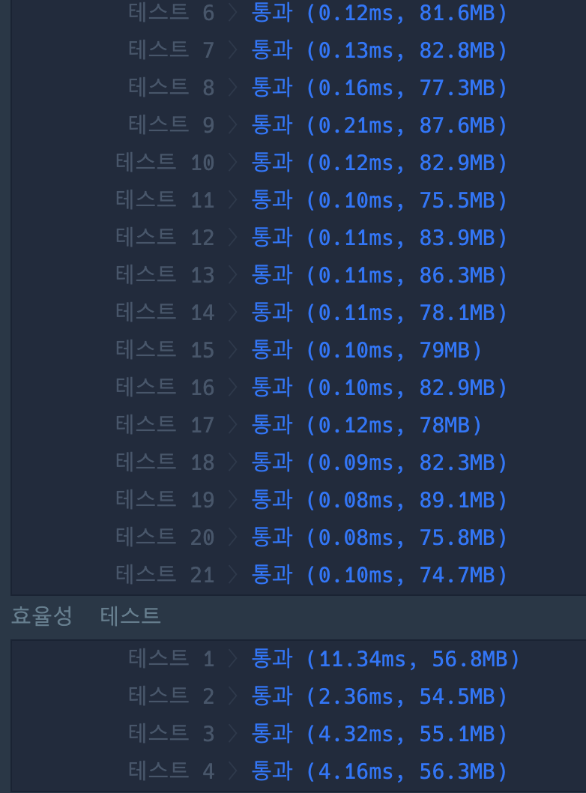

```java
import java.util.*;
import java.io.*;

class Solution {

    static int[][] dir = {{1, 0}, {-1, 0}, {0, 1}, {0, -1}};
    static int[][] Map;
    static int row, col;
    public int solution(int[][] maps) {

        Map = maps;
        row = maps.length;
        col = maps[0].length;
        return bfs();
    }

    static int bfs() {
        boolean[][] visited = new boolean[row][col];
        Queue<int[]> queue = new LinkedList<>();
        queue.add(new int[]{0, 0, 1}); // 맨 마지막은 블록 수
        visited[0][0] = true;

        while (!queue.isEmpty()) {
            int[] info = queue.poll();
            int curRow = info[0];
            int curCol = info[1];
            int curCount = info[2];
            if (curRow == row - 1 && curCol == col - 1) return curCount;

            for (int i = 0; i < 4; i++) {
                int nextRow = curRow + dir[i][0];
                int nextCol = curCol + dir[i][1];
                if (nextRow >= row || nextRow < 0 || nextCol >= col || nextCol < 0) continue;
                if (visited[nextRow][nextCol] || Map[nextRow][nextCol] == 0) continue;
                visited[nextRow][nextCol] = true;
                queue.add(new int[]{nextRow, nextCol, curCount + 1});
            }
        }

        return -1;

    }
}
```

### 실행결과
