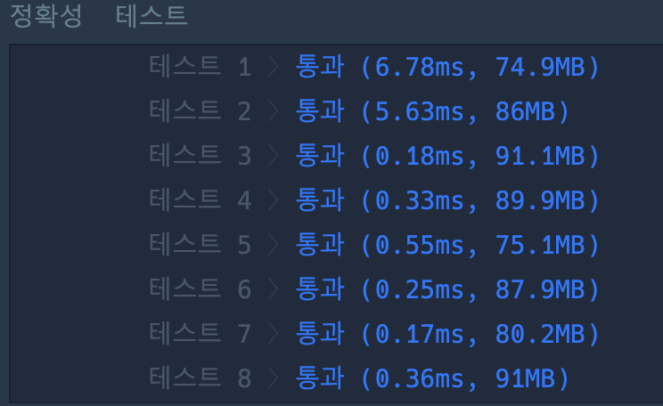

```java
import java.util.*;
import java.io.*;

class Solution {

    static int Length;
    static int Target;
    static int[] Numbers;
    
    public int solution(int[] numbers, int target) {
        
        Length = numbers.length;
        Target = target;
        Numbers = numbers;
        
        return dfs(0, 0);
    }
    
    static int dfs(int curLen, int sum) {
        if (curLen == Length) {
            if (sum == Target) {
                return 1;
            }
            return 0;
        }
        
        return dfs(curLen + 1, sum + Numbers[curLen]) + dfs(curLen + 1, sum - Numbers[curLen]);
    }

}
```

### 실행결과
