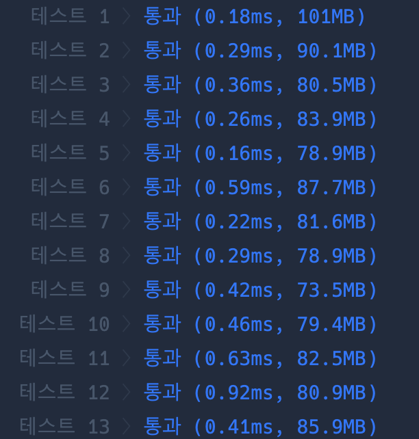

```java
import java.util.*;

class Solution {

    static int[] parent;
    static int[][] Com;
    static HashSet<Integer> set = new HashSet<>();

    public int solution(int n, int[][] computers) {

        parent = new int[n];
        Com = computers;

        init();
        cal();

        return set.size();

    }

    static void union(int a, int b) {
        int aRoot = find(a);
        int bRoot = find(b);
        parent[aRoot] = bRoot;
    }

    static int find(int a) {
        if (parent[a] == a) return a;
        else return parent[a] = find(parent[a]);
    }

    static void init() {
        for (int i = 1; i < parent.length; i++) {
            parent[i] = i;
        }
    }

    static void cal() {
        for (int i = 0; i < parent.length; i++) {
            for (int j = 0; j < parent.length; j++) {
                if (i == j || Com[i][j] == 0) continue;
                union(i, j);
            }
        }

        for (int i = 0; i < parent.length; i++) set.add(find(i));
    }
}
```

### 실행결과

