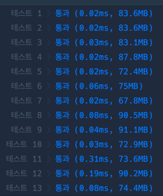

```java
import java.util.*;

class Solution {

    private boolean[] visited;
    private int[][] Computers;

    public int solution(int n, int[][] computers) {
        int answer = 0;
        visited = new boolean[n];
        Computers = computers;

        for (int i = 0; i < n; i++) {
            if (!visited[i]) {
                dfs(i);
                answer++;
            }
        }
        return answer;
    }

    private void dfs(int curNode) {
        visited[curNode] = true;
        for (int i = 0; i < Computers.length; i++) {
            if (Computers[curNode][i] == 1 && !visited[i] && curNode != i) {
                dfs(i);
            }
        }
    }
}
```
### 제출 시간
