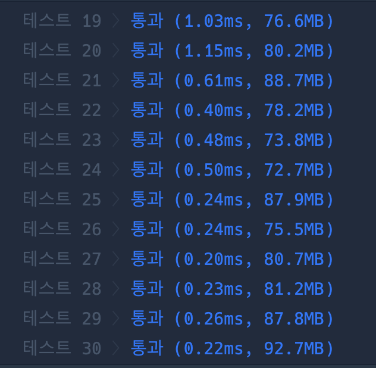

```java
import java.util.*;

class Solution {

    static int[][] map = new int[102][102]; // 좌표를 2배로 확장
    static int[][] dir = {{1, 0}, {-1, 0}, {0, 1}, {0, -1}};
    static int startRow, startCol, targetRow, targetCol;

    public int solution(int[][] rectangle, int characterX, int characterY, int itemX, int itemY) {
        startRow = characterX * 2;
        startCol = characterY * 2;
        targetRow = itemX * 2;
        targetCol = itemY * 2;

        init(rectangle);
        return bfs() / 2; // 이동 거리도 절반으로 줄여서 반환
    }

    // 테두리는 1, 내부는 -1로 표기
    static void init(int[][] rectangle) {
        for (int[] rect : rectangle) {
            mark(rect[0] * 2, rect[1] * 2, rect[2] * 2, rect[3] * 2);
        }
    }

    static void mark(int row1, int col1, int row2, int col2) {
        for (int i = row1; i <= row2; i++) {
            for (int j = col1; j <= col2; j++) {
                if (map[i][j] == -1) continue; // 이미 내부로 채워진 경우
                if (i == row1 || i == row2 || j == col1 || j == col2) {
                    if (map[i][j] == 0) map[i][j] = 1; // 테두리
                } else {
                    map[i][j] = -1; // 내부
                }
            }
        }
    }

    static int bfs() {
        Queue<int[]> queue = new LinkedList<>();
        boolean[][] visited = new boolean[102][102];

        queue.add(new int[]{startRow, startCol, 0});
        visited[startRow][startCol] = true;

        while (!queue.isEmpty()) {
            int[] cur = queue.poll();
            int curRow = cur[0];
            int curCol = cur[1];
            int curDis = cur[2];

            if (curRow == targetRow && curCol == targetCol) {
                return curDis;
            }

            for (int[] d : dir) {
                int nextRow = curRow + d[0];
                int nextCol = curCol + d[1];

                if (nextRow < 0 || nextRow > 100 || nextCol < 0 || nextCol > 100) continue;
                if (visited[nextRow][nextCol] || map[nextRow][nextCol] != 1) continue;

                visited[nextRow][nextCol] = true;
                queue.add(new int[]{nextRow, nextCol, curDis + 1});
            }
        }

        return -1; // 도달 불가
    }
}
```

### 실행결과

