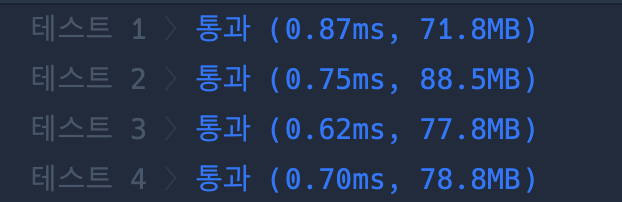

```java
import java.util.*;

class Solution {

    static Map<String, Map<String, Integer>> map = new HashMap<>();
    static List<String> answer = new ArrayList<>();
    static int len;
    public String[] solution(String[][] tickets) {

        len = tickets.length;
        for (int i = 0; i < tickets.length; i++) {
            String start = tickets[i][0];
            String end = tickets[i][1];
            map.putIfAbsent(start, new TreeMap<>());
            map.get(start).put(end, map.get(start).getOrDefault(end, 0) + 1);
        }

        List<String> path = new ArrayList<>();
        path.add("ICN");
        dfs("ICN", path);

        return answer.toArray(new String[0]); //자동으로 적절한 크기 배열 생성함
    }

    static boolean dfs(String cur, List<String> path) {
        if (path.size() == len + 1) {
            answer = new ArrayList<>(path);
            return true;
        }

        if (!map.containsKey(cur)) return false;

        for (String next : map.get(cur).keySet()) {
            if (map.get(cur).get(next) > 0) {
                map.get(cur).put(next, map.get(cur).get(next) - 1);
                path.add(next);

                if (dfs(next, path)) return true;

                map.get(cur).put(next, map.get(cur).get(next) + 1);
                path.remove(path.size() - 1);
            }
        }

        return false;
    }


}
```

### 실행결과

