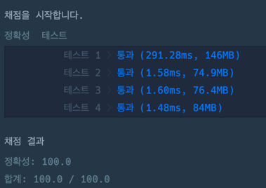

```java
import java.util.*;

class Solution {

    private HashMap<String,List<String>> graph = new HashMap<>();
    private HashMap<String,Integer> visited = new HashMap<>();
    private List<List<String>> paths = new ArrayList<>();
    private int ticketsCount = 0;
    
    public String[] solution(String[][] tickets) {
        String[] answer = {};
        
        ticketsCount = tickets.length;
        
        for(String[] ticket: tickets) {
            String from = ticket[0];
            String to = ticket[1];
            
            graph.putIfAbsent(from, new ArrayList<>());            
            graph.get(from).add(to);
            visited.put(from+to, visited.getOrDefault(from + to, 0) + 1);
        }
        
        for (List<String> tos : graph.values()) {
            Collections.sort(tos);
        }
        
        findPath("ICN", new ArrayList<>(),0);
        
        return paths.get(0).toArray(new String[0]);
    }
    
    void findPath(String curPath, List<String> path, int cnt) {
        
        path.add(curPath);
        
        if(cnt == ticketsCount) {
            paths.add(new ArrayList<>(path));
            return;
        }
        
        if(!graph.containsKey(curPath)) {
            return;
        }
        
        for(String nextPath: graph.get(curPath)) {
            String visitedPath = curPath + nextPath;
            if(visited.get(visitedPath) == 0) continue;
            
            visited.put(visitedPath, visited.get(visitedPath) - 1);
            findPath(nextPath, path,cnt+1);
            path.remove(path.size() - 1);
            visited.put(visitedPath, visited.get(visitedPath) + 1);
        }
    }
}
```
### 실행 결과
