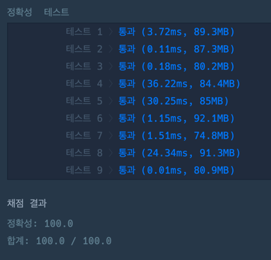

### 풀이 코드
```java
import java.util.*;

class Solution {

    public int solution(int N, int number) {
        if(N == number) return 1;
        
        List<Set<Integer>> dp = new ArrayList<>();
        
        for(int i = 0; i <= 8; i++) {
            dp.add(new HashSet<>());
        }
        
        for(int i = 1; i <= 8; i++) {
            dp.get(i).add(Integer.parseInt(String.valueOf(N).repeat(i)));
        }
        
        for(int i = 1; i <= 8; i++) {
            for(int j = 0; j < i; j++) { // dp[i] = dp[j] + dp[i - j]
                for(int x : dp.get(j)) {
                    for(int y : dp.get(i - j)) {
                        dp.get(i).add(x + y);
                        dp.get(i).add(x - y);
                        dp.get(i).add(x * y);
                        if(y != 0) {
                            dp.get(i).add(x / y);
                        }
                    }
                }
            }
            
            if(dp.get(i).contains(number)) {
                return i;
            }
        }
                
        return -1;
    }
}
```

### 실행 결과
