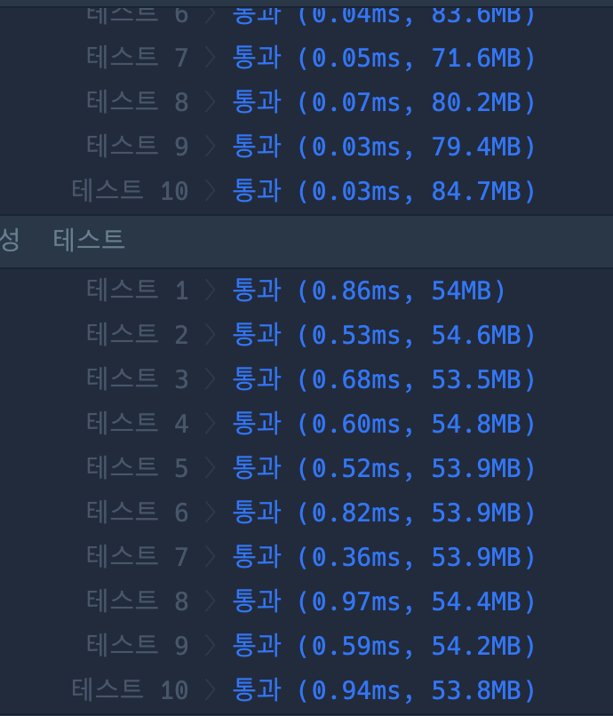

```java
import java.util.*;

class Solution {
    public int solution(int m, int n, int[][] puddles) {

        int[][] dist = new int[n + 1][m + 1];
        int[][] map = new int[n + 1][m + 1];

        for (int[] p : puddles) {
            map[p[1]][p[0]] = -1;
        }

        dist[1][1] = 1;

        for (int i = 1; i <= n; i++) {
            for (int j = 1; j <= m; j++) {
                if (map[i][j] == -1) continue;

                // 오른쪽으로 이동
                if (j + 1 <= m && map[i][j + 1] != -1)  dist[i][j + 1] = (dist[i][j + 1] + dist[i][j]) % 1_000_000_007;

                // 아래로 이동
                if (i + 1 <= n && map[i + 1][j] != -1)  dist[i + 1][j] = (dist[i + 1][j] + dist[i][j]) % 1_000_000_007;

            }
        }

        return dist[n][m];
    }
}


```

### 실행결과

