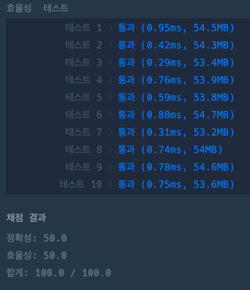

### 풀이 코드
```java
import java.util.*;

class Solution {

    private int[][] map;
    
    private final int DIVIDED_NUMBER = 1_000_000_007;
    
    public int solution(int m, int n, int[][] puddles) {
        
        map = new int[m][n];
        for(int i = 0; i < m; i++) {
            Arrays.fill(map[i], 1);
        }
        
        for(int[] puddle: puddles) {
            int y = puddle[0];
            int x = puddle[1];
            map[y-1][x-1] = 0;
        }
        
        return findShortestPath(puddles, n, m);
    }
    
    private int findShortestPath(int[][] puddles, int n, int m) {
        
        for(int i = 0; i < m; i++) {
            for(int j = 0; j < n; j++) {
                if(i == 0 && j == 0) continue;
                
                if(map[i][j] == 0) {
                    continue;
                }
                
                if(i == 0 && j - 1 >= 0) {
                    map[i][j] = map[i][j - 1];
                    continue;
                }
                
                if(j == 0 && i - 1 >= 0) {
                    map[i][j] = map[i - 1][j];
                    continue;
                }
                
                if(i-1 >= 0 && j - 1 >= 0) {
                    map[i][j] = map[i-1][j] % DIVIDED_NUMBER + map[i][j-1] % DIVIDED_NUMBER;
                }
            }
        }
        
        return map[m-1][n-1] % DIVIDED_NUMBER;
    }
}
```

### 출력 결과
