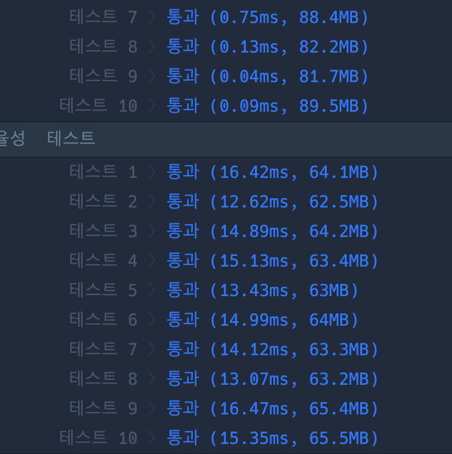

```java
import java.util.*;

class Solution {
    public int solution(int[][] triangle) {
        int answer = 0;
        int h = triangle.length;
        int w = triangle[h - 1].length;

        int[][] dp = new int[h][w];
        dp[0][0] = triangle[0][0];

        for (int i = 0; i < h; i++) {
            for (int j = 0; j < triangle[i].length; j++) {

                if (i + 1 < h) { // 왼쪽아래
                    dp[i + 1][j] = Math.max(dp[i + 1][j], dp[i][j] + triangle[i + 1][j]);

                    if (j + 1 < triangle[i + 1].length) { // 오른쪽 아래
                        dp[i + 1][j + 1] = Math.max(dp[i + 1][j + 1], dp[i][j] + triangle[i + 1][j + 1]);
                    }
                }

            }

        }

        int max = 0;
        for (int value : dp[h - 1]) max = Math.max(max, value);

        return max;
    }
}


```

### 실행결과

