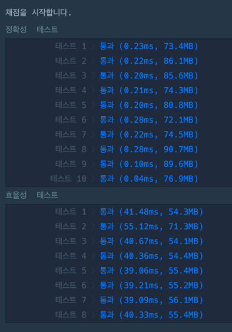

### 풀이 코드
```java
import java.util.*;

class Solution {
    public int solution(String[] arr) {
        
        int n = arr.length / 2 + 1;
        
        int[][] dp_max = new int[n][n];
        int[][] dp_min = new int[n][n];
        
        for(int i = 0; i < n; i++) {
            dp_max[i][i] = Integer.parseInt(arr[2 * i]);
            dp_min[i][i] = Integer.parseInt(arr[2 * i]);
        }
        
        for(int oplen = 1; oplen < n; oplen++) {
            for(int i = 0; i < n - oplen; i++) {
                int j = i + oplen;
                
                dp_max[i][j] = Integer.MIN_VALUE;
                dp_min[i][j] = Integer.MAX_VALUE;
                
                for(int k = i; k < j; k++) {
                    String op = arr[2*k+1];
                    
                    int a = calc(dp_max[i][k], dp_max[k+1][j],op);
                    int b = calc(dp_max[i][k], dp_min[k+1][j],op);
                    int c = calc(dp_min[i][k], dp_max[k+1][j],op);
                    int d = calc(dp_min[i][k], dp_min[k+1][j],op);
                    
                    dp_max[i][j] = Math.max(dp_max[i][j], Math.max(Math.max(a,b), Math.max(c,d)));
                    dp_min[i][j] = Math.min(dp_min[i][j], Math.min(Math.min(a,b), Math.min(c,d)));
                }
            }
        }
        
        return dp_max[0][n-1];
    }
    
    private int calc(int x, int y, String op) {
        return op.equals("+") ? x + y : x - y;
    }
}

```

### 출력 결과
