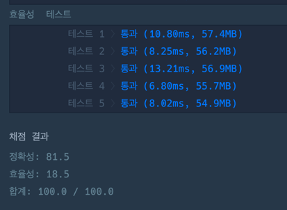

### 풀이 코드
```java
import java.util.*;

class Solution {
    public int solution(int[] people, int limit) {
        int answer = 0;
        
        Arrays.sort(people);
        
        int first = 0;
        int second = people.length - 1;
        while(first <= second) {
            if(people[first] + people[second] <= limit) {
                first++;
            }
            
            second--;
            answer++;
        }
        
        return answer;
    }
}
```

### 출력 결과
