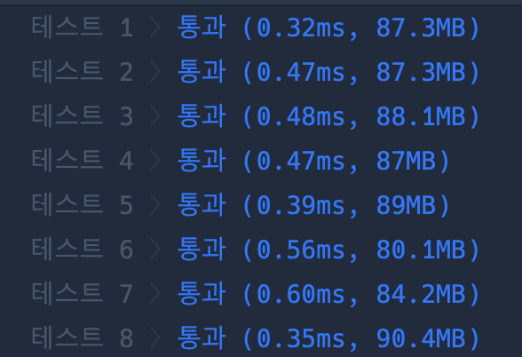

```java
import java.util.*;

class Solution {

    static int[] parent;
    static List<Edge> edges = new ArrayList<>();

    public int solution(int n, int[][] costs) {
        int answer = 0;
        parent = new int[n];

        for (int i = 0; i < n; i++) {
            parent[i] = i;
        }

        for (int i = 0; i < costs.length; i++) {
            int from = costs[i][0];
            int to = costs[i][1];
            int weight = costs[i][2];
            edges.add(new Edge(from, to, weight));
            edges.add(new Edge(to, from, weight));
        }


        return MST(n);
    }

    static int MST(int n) {
        int selectedEdge = 0;
        int sum = 0;
        Collections.sort(edges);

        for (Edge edge : edges) {
            if (find(edge.from) != find(edge.to)) {
                sum += edge.weight;
                selectedEdge++;
                union(edge.from, edge.to);
            }

            if (selectedEdge == n - 1) return sum;
        }

        return -1;
    }

    static int find(int a) {
        if (parent[a] == a) return a;
        return parent[a] = find(parent[a]);
    }

    static void union(int a, int b) {
        int aRoot = find(a);
        int bRoot = find(b);
        parent[aRoot] = bRoot;
    }
}

class Edge implements Comparable<Edge> {
    int from;
    int to;
    int weight;

    Edge(int from, int to, int weight) {
        this.from = from;
        this.to = to;
        this.weight = weight;
    }

    @Override
    public int compareTo(Edge e) {
        return this.weight - e.weight;
    }

}


```

### 실행결과

