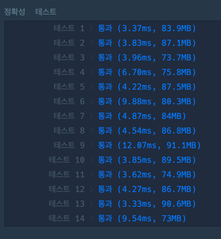

### 풀이
```java
import java.util.ArrayList;
import java.util.Arrays;

class Solution {
    public int[] solution(int[] answers) {
        int [] count = new int[3];
        ArrayList<Integer> resultList = new ArrayList<>();
        //학생별 찍는 방식
        int[] student1 = {1,2,3,4,5};
        int[] student2 = {2,1,2,3,2,4,2,5};
        int[] student3 = {3,3,1,1,2,2,4,4,5,5};
        
        //학생별 정답 확인
        for(int i=0; i<answers.length; i++){
            if(answers[i] == student1[i % student1.length]){
                count[0]++;
            }
            if(answers[i] == student2[i % student2.length]){
                count[1]++;
            }
            if(answers[i] == student3[i % student3.length]){
                count[2]++;
            }

    }
          // 점수를 리스트에 추가
        ArrayList<Integer> scores = new ArrayList<>();
        scores.add(count[0]); // 수포자 1 점수
        scores.add(count[1]); // 수포자 2 점수
        scores.add(count[2]); // 수포자 3 점수

        // max, min, mid 계산
        int max = Math.max(count[0], Math.max(count[1], count[2]));

        // max에 해당하는 인덱스만 추가
        for (int j = 0; j < scores.size(); j++) {
            if (scores.get(j) == max) { // max 점수만 비교
                resultList.add(j + 1); // 수포자 번호 추가 (1부터 시작)
            }
        }

        // 배열 정렬 
        resultList.sort(Integer::compareTo); // 오름차순 정렬

        // 결과를 int 배열로 변환하여 반환
        return resultList.stream().mapToInt(k -> k).toArray();
    }
}  
```

