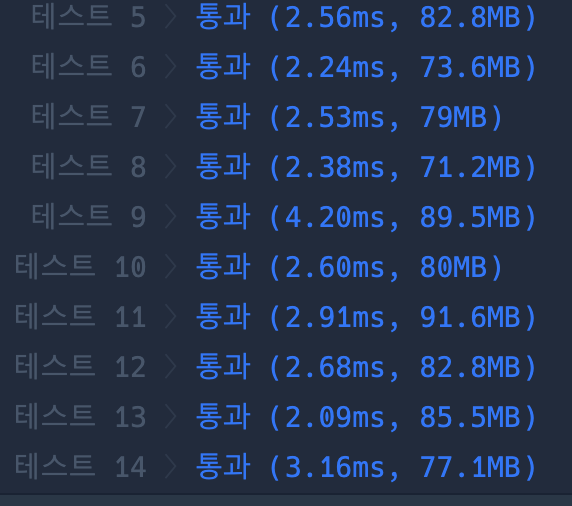

```java
import java.util.*;

class Solution {
    public int[] solution(int[] answers) {
        int[][] infos = {
                {1, 2, 3, 4, 5},
                {2, 1, 2, 3, 2, 4, 2, 5},
                {3, 3, 1, 1, 2, 2, 4, 4, 5, 5}
        };

        int[] scores = new int[3];

        for (int i = 0; i < answers.length; i++) {
            for (int j = 0; j < 3; j++) {
                if (answers[i] == infos[j][i % infos[j].length]) {
                    scores[j]++;
                }
            }
        }

        int maxScore = Math.max(scores[0], Math.max(scores[1], scores[2]));

        List<Integer> result = new ArrayList<>();
        for (int i = 0; i < 3; i++) {
            if (scores[i] == maxScore) {
                result.add(i + 1);
            }
        }

        return result.stream().mapToInt(Integer::intValue).toArray();
    }
}
```

### 실행결과

