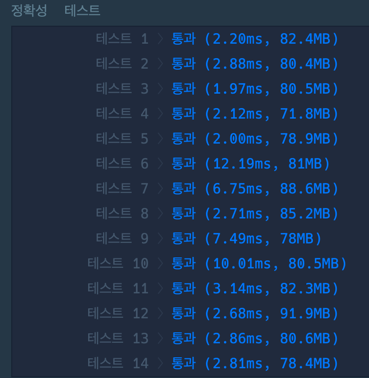

### 풀이 코드
```java
import java.util.*;

class Solution {
    public int[] solution(int[] answers) {
        List<Integer> answer = new ArrayList<>();
        
        int[] firstPerson = new int[] {1,2,3,4,5};
        int[] secondPerson = new int[] {2,1,2,3,2,4,2,5};
        int[] thirdPerson = new int[] {3,3,1,1,2,2,4,4,5,5};
        
        int firstAnswerCnt = findAnswerCnt(firstPerson, answers);
        int secondAnswerCnt = findAnswerCnt(secondPerson, answers);
        int thirdAnswerCnt = findAnswerCnt(thirdPerson, answers);

        int maxValue = Math.max(firstAnswerCnt, Math.max(secondAnswerCnt, thirdAnswerCnt));
        
        int idx = 0;
        for(int value: new int[]{firstAnswerCnt, secondAnswerCnt, thirdAnswerCnt}) {
            idx++;
            if(maxValue == value) {
                answer.add(idx);
            }
        }
        
        return answer.stream().mapToInt(Integer::intValue).toArray();
    }
    
    private int findAnswerCnt(int[] person, int[] answers) {
        int answerCnt = 0;
        for(int i = 0; i < answers.length; i++) {
            if(answers[i] == person[i%person.length]) {
                answerCnt++;
            }
        }
        
        return answerCnt;
    }
}
```

### 걸린 시간
