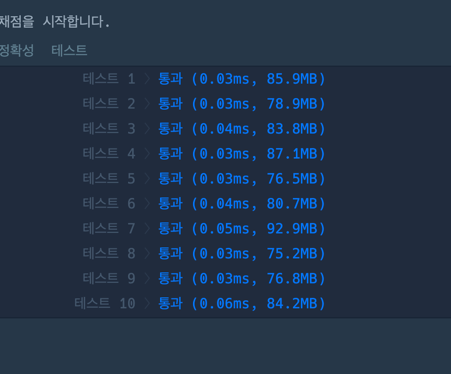

### 풀이
```java
import java.util.Arrays;
class Solution {
    public int solution(int[][] sizes) {
        
        int maxW = 0; // 최대 가로
        int maxH = 0; // 최대 세로

        for (int[] size : sizes) { //각 배열에서 최대.최솟값 찾기
            int w = Math.max(size[0], size[1]); // 최대 가로
            int h = Math.min(size[0], size[1]); // 최소 세로
            
            maxW = Math.max(maxW, w); //최대 가로
            maxH = Math.max(maxH, h); //최소 세로
        }

        //최소 넓이 값 
        int result = maxW * maxH;

        return result;

    }
}
```

