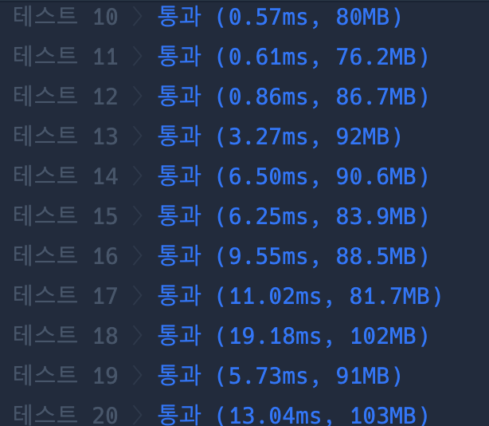

```java
import java.util.*;

class Solution {
    public int solution(int[][] sizes) {
        int answer = 0;
        List<Integer> w = new ArrayList<>();
        List<Integer> h = new ArrayList<>();

        for (int[] size : sizes) {
            w.add(Math.min(size[0], size[1]));
            h.add(Math.max(size[0], size[1]));
        }
        Collections.sort(w);
        Collections.sort(h);

        return w.get(sizes.length - 1) * h.get(sizes.length - 1);
    }
}
```

### 실행결과

