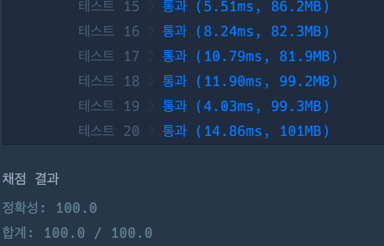

### 풀이 코드
```java
import java.util.*;

class Solution {
    public int solution(int[][] sizes) {
        int answer = 0;

        List<Integer> maxValue = new ArrayList<>();
        List<Integer> minValue = new ArrayList<>();

        for(int[] size: sizes) {
            maxValue.add(Math.max(size[0], size[1]));
            minValue.add(Math.min(size[0], size[1]));
        }

        Collections.sort(maxValue);
        Collections.sort(minValue);

        answer = maxValue.get(maxValue.size() - 1) * minValue.get(minValue.size() - 1);

        return answer;
    }
}
```
### 실행 결과


### 풀이 설명
직사각형이기에 가로의 길이가 세로의 길이보다 커야한다는 특성이 있습니다. 
그렇기에, 두가지 List를 통해서 가로의 길이가 될 수 있는 리스트, 세로가 될 수 있는 리스트로 나누었습니다.  
기준은 주어진 배열에서 각각 w와 h를 비교해 주었고, 최종적으로 정렬을 한후 가로의 길이에서 가장긴 수와 세로의 길이에서 가장 긴 수를 선택해주었습니다. 