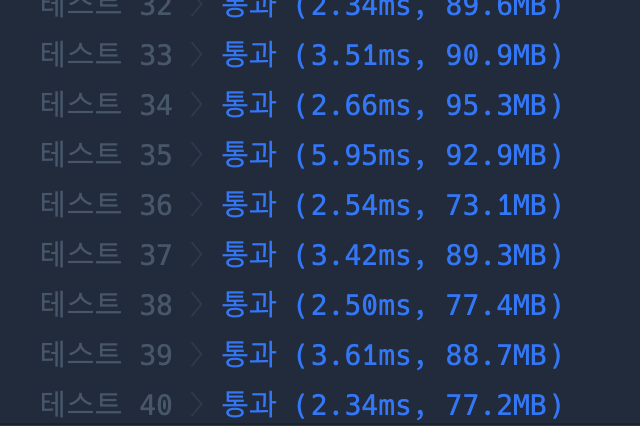

```java
import java.util.*;

class Solution {
    static char[] alphabet = {'A', 'E', 'I', 'O', 'U'};
    static List<String> words = new ArrayList<>();

    public int solution(String word) {

        makeDir(0, new StringBuilder());

        int idx = 0;
        for (String w : words) {
            if (w.equals(word)) break;
            idx++;
        }

        return idx;
    }

    static void makeDir(int len, StringBuilder sb) {
        if (len > 5) return;

        words.add(sb.toString());

        for (int i = 0; i < 5; i++) {

            sb.append(alphabet[i]);
            makeDir(len + 1, sb);
            sb.deleteCharAt(sb.length() - 1);

        }
    }

}


```

### 실행결과

