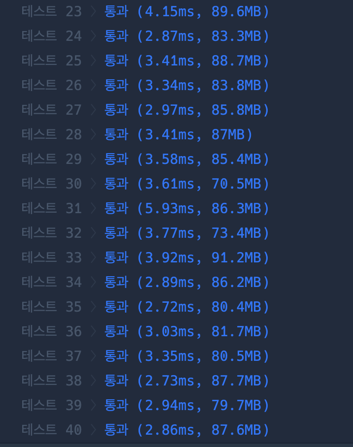

``` java
import java.io.*;
import java.util.*;

class Solution {
    
    private static String W;
    private static HashMap<Integer, String> map = new HashMap<>();
    {
        map.put(0, "A");
        map.put(1, "E");
        map.put(2, "I");
        map.put(3, "O");
        map.put(4, "U");
    }
    
    private static int cnt, result;
    private static boolean isPull;
    
    public int solution(String word) {
        W = word;
        dfs(0, "");
        int answer = result;
        return answer;
    }
    
    private static void dfs(int depth, String s) {
        
        if(s.equals(W)) {
            result = cnt;
        }
        
        if(depth == 5) {
            return;
        }else {
            
            for(int i = 0; i<5; i++) {
                String tmp = s;
                cnt++;
                dfs(depth+1, s+=map.get(i));
                s = tmp;
            }
            
        }
        
    }
}
```

