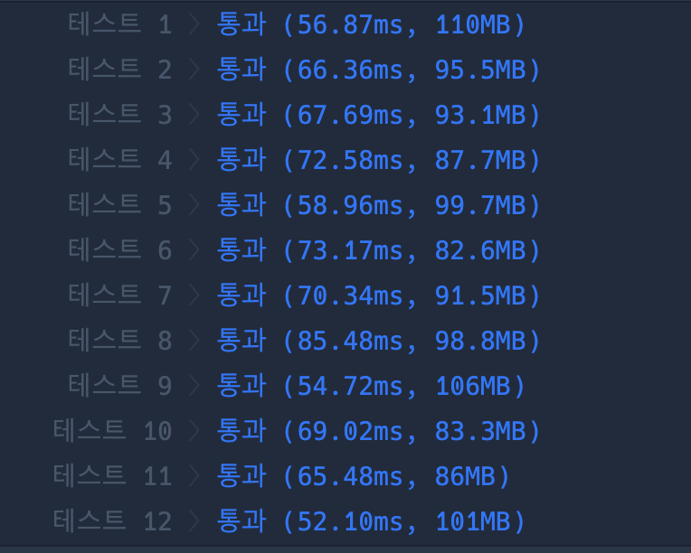

```java
import java.util.*;

class Solution {
    static final int MAX = 9999999;
    static boolean[] isPrime = new boolean[MAX + 1];
    static boolean[] visited;
    static Set<Integer> set = new HashSet<>();
    static String Numbers;

    public int solution(String numbers) {
        int answer = 0;
        visited = new boolean[numbers.length()];
        Numbers = numbers;
        PrimeInit();
        StringBuilder sb = new StringBuilder();
        dfs(sb);

        return cal();
    }


    static void PrimeInit() {
        Arrays.fill(isPrime, true);
        isPrime[0] = false;
        isPrime[1] = false;

        for (int i = 2; i * i < isPrime.length; i++) {
            if (isPrime[i]) {
                for (int j = i * i; j < isPrime.length; j += i) {
                    isPrime[j] = false;
                }
            }
        }
    }

    static void dfs(StringBuilder sb) {
        if (sb.length() != 0) {
            set.add(Integer.parseInt(sb.toString()));
        }

        for (int i = 0; i < visited.length; i++) {
            if (!visited[i]) {
                visited[i] = true;
                dfs(sb.append(Numbers.charAt(i)));
                visited[i] = false;
                sb.deleteCharAt(sb.length() - 1);
            }
        }
    }


    static int cal() {
        int sum = 0;
        for (int a : set) {
            if (isPrime[a]) sum++;
        }

        return sum;
    }
}

```

### 실행결과

