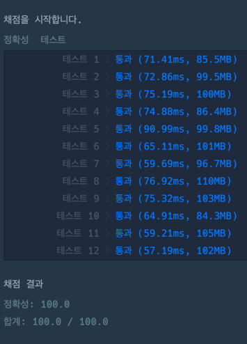

### 풀이 코드 

```java
import java.util.*;

class Solution {
    
    private boolean[] check = new boolean[10000000];
    private Set<Integer> answer = new HashSet<>();
    
    public int solution(String numbers) {
        
        saveCheckPrime();
        
        String[] numberValues = numbers.split("");
        
        for(int i = 0; i < numbers.length(); i++) {
          permu(numberValues, "", new boolean[numbers.length()], 0, i+1);
        }
        
        System.out.println(answer);
        
        return answer.size();
    }
    
    private void permu(String[] arr, String output, boolean[] visited, int depth, int r) {
        if(depth == r) {
            int number = Integer.valueOf(output);
            if(check[number]) {
                answer.add(number);
            }
            return;
        }
        
        for(int i = 0; i < arr.length; i++) {
            if(!visited[i]) {
                visited[i] = true;
                output += arr[i];
                permu(arr, output, visited, depth + 1, r);
                output = output.substring(0,output.length() - 1);
                visited[i] = false;
            }
        }
    }
    
    private void saveCheckPrime() {
        for (int i = 2; i < check.length; i++) {
            check[i] = true;
        }
        
        for (int i = 2; i * i <= 9999999; i++) {
            if (check[i]) {
                for (int j = i * i; j <= 9999999; j += i) {
                    check[j] = false;
                }
            }
        }
    }
}
```

### 제출 시간
