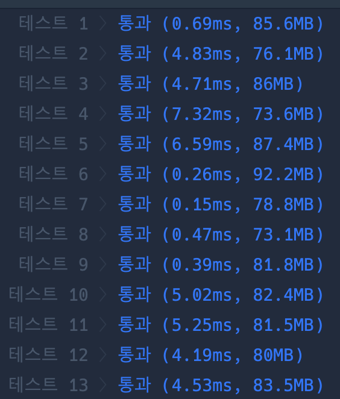

```java
import java.util.*;

import java.util.*;

class Solution {
    static Set<Integer>[] edges;
    static int N;
    public int solution(int n, int[][] wires) {
        edges = new HashSet[n + 1];
        N = n;
        int answer = Integer.MAX_VALUE;

        for (int i = 1; i <= n ; i++) {
            edges[i] = new HashSet<>();
        }

        for (int i = 0; i < wires.length; i++) {
            int start = wires[i][0];
            int end = wires[i][1];
            edges[start].add(end);
            edges[end].add(start);
        }

        for (int[] wire : wires) {
            int start = wire[0];
            int end = wire[1];
            edges[start].remove(end);
            edges[end].remove(start);

            answer = Math.min(answer, bfs(start));

            edges[start].add(end);
            edges[end].add(start);
        }


        return answer;
    }

    static int bfs(int start) {
        boolean[] visited = new boolean[N + 1];
        visited[start] = true;
        Queue<Integer> q = new LinkedList<>();
        q.add(start);
        int cnt = 0;

        while (!q.isEmpty()) {
            int cur = q.poll();
            cnt++;

            for (int next : edges[cur]) {
                if (visited[next]) continue;
                visited[next] = true;
                q.add(next);
            }
        }

        return Math.abs(N - cnt - cnt);

    }


}


```

### 실행결과

