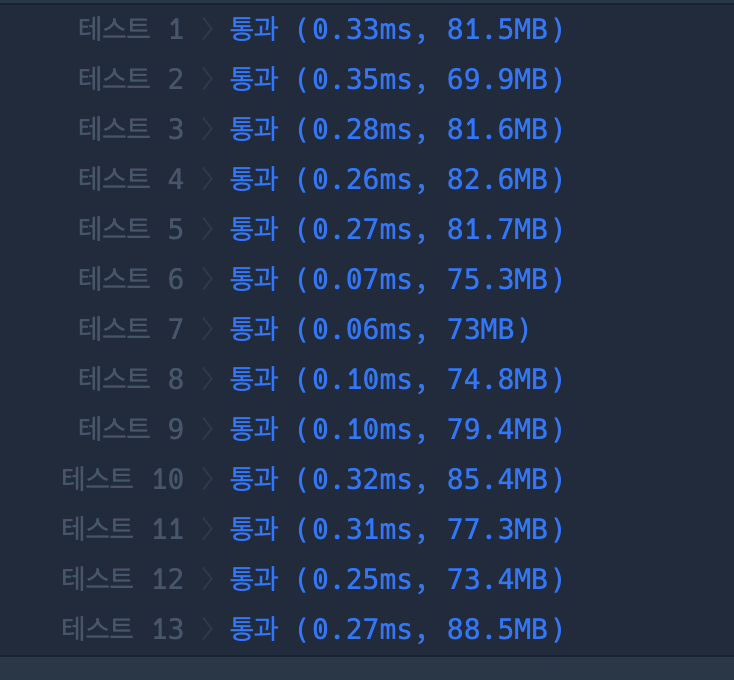

``` java
import java.io.*;
import java.util.*;

class Solution {
    
    private static int[] visited = new int[4];
    private static ArrayList<Integer>[] adj;
    private static int min;
    
    public int solution(int n, int[][] wires) {
        
        adj = new ArrayList[n+1];
        
        min = 987654321;
        
      
        for(int i = 1; i <= n; i++) {
            adj[i] = new ArrayList<>();
        }

        for(int i = 0; i < n-1; i++) {
            adj[wires[i][0]].add(wires[i][1]);
            adj[wires[i][1]].add(wires[i][0]);
        }
            
        dfs(1, n);
            
        return min;
    }
    
    private static int dfs(int st, int n) {
        visit(st);
        int cnt = 1;
        
            
        for(int c : adj[st]) {
            
            if(!isVisit(c)) {
                visit(c);
                cnt+= dfs(c, n);
            }
                
        }
        
        min = Math.min(min, Math.abs(cnt - (n - cnt)));
        
        return cnt;
        
    }
    
    private static boolean isVisit(int i) {
        
        
        if((visited[i / 32] & (1 << (i % 32))) == 0) return false;
        
        return true;
        
    }
    
    private static void visit(int i) {
        
        visited[i / 32] |= ( 1 << (i % 32));
        
    }
    
}
```

