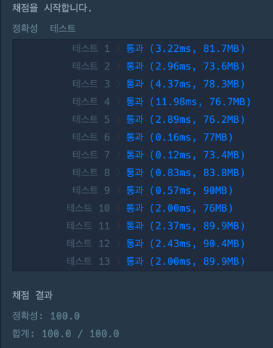

### 풀이 코드
```java
import java.util.*;

class Solution {
    private List<List<Integer>> graph = new ArrayList<>();
    private int curCnt = 0;
    
    public int solution(int n, int[][] wires) {
        int answer = Integer.MAX_VALUE;
        
        for(int i = 0; i <= n; i++) {
            graph.add(new ArrayList<>());
        }
        
        for(int i = 0; i < wires.length; i++) {
            int[] wire = wires[i];
            graph.get(wire[0]).add(wire[1]);
            graph.get(wire[1]).add(wire[0]);
        }
        
        for(int i = 0; i < wires.length; i++) {
            int[] disconnectWire = wires[i];
            graph.get(disconnectWire[0]).remove((Integer)(disconnectWire[1]));
            graph.get(disconnectWire[1]).remove((Integer)(disconnectWire[0]));
            answer = Math.min(answer, getDifferenceValue(n));
            graph.get(disconnectWire[0]).add((Integer)(disconnectWire[1]));
            graph.get(disconnectWire[1]).add((Integer)(disconnectWire[0]));
        }
        
        return answer;
    }
    
    private int getDifferenceValue(int n) {
        boolean[] visited = new boolean[n + 1];
        List<Integer> cnts = new ArrayList<>();
        for(int i = 1; i <= n; i++) {
            if(!visited[i]) {
                visited[i] = true;
                dfs(visited, i);
                cnts.add(curCnt);
                curCnt = 0;
            }
        }
    
        return Math.abs(cnts.get(0) - cnts.get(1));
    }
    
    private void dfs(boolean[] visited, int cur) {
        
        if(graph.get(cur).size() == 0) {
            return;
        }
        
        for(int next : graph.get(cur)) {
            if(!visited[next]) {
                visited[next] = true;
                curCnt++;
                dfs(visited, next);
            }
        }
    }
    
}
```

### 출력 결과
