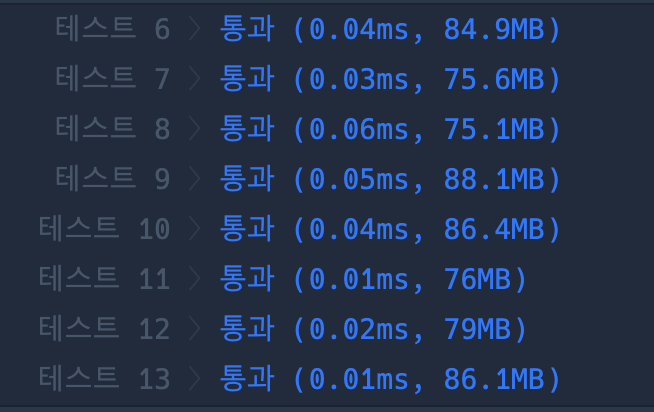

```java
class Solution {
    static int w;
    static int h;
    static int totalArea;
    public int[] solution(int brown, int yellow) {
        int[] answer = new int[2];

        totalArea = brown + yellow;
        w = 1;
        h = totalArea;
        int brownSum = 0;

        while (true) {
            brownSum = w * 2 + (h - 2) * 2;
            // 갈색 개수 : 가로 + 가로 + (세로 - 2) + (세로 - 2)
            if (brownSum == brown) break;
            next();
        }

        answer[0] = h;
        answer[1] = w;
        return answer;
    }

    static void next() {
        for (int i = w + 1; i <= totalArea; i++) {
            if (totalArea % i == 0) {
                w = i;
                h = totalArea / w;
                return;
            }
        }
    }

}
```

### 실행결과

