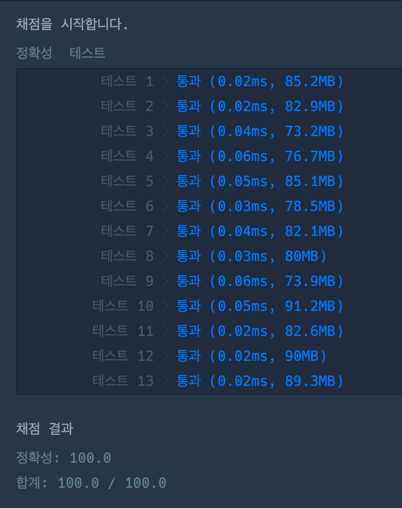

### 풀이 코드
```java
import java.util.*;

class Solution {
    
    private List<Integer> answers = new ArrayList<>();
    
    public int[] solution(int brown, int yellow) {
        int[] answer = new int[2];
        
        int totalCnt = brown + yellow;
        
        for(int i = 1; i <= 2500000; i++) {
            if(totalCnt % i == 0) {
                if(i >= (totalCnt / i) && (i-2) * (totalCnt / i - 2) == yellow) {
                    answer[0] = i;
                    answer[1] = totalCnt / i;
                    break;
                }
            }
        }
        
        return answer;
    }
}
```

### 실행 시간
