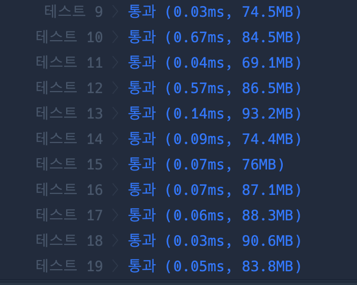

```java
import java.util.*;

class Solution {

    static int totalLen, max;
    static boolean[] visited;
    static int[][] D;
    static List<ArrayList<Integer>> orders = new ArrayList<>();

    public int solution(int k, int[][] dungeons) {
        totalLen = dungeons.length;
        visited = new boolean[totalLen];
        D = dungeons;

        // permutation(0, new ArrayList<Integer>());

        // return findMax(k);

        max = 0;
        dfs(k, 0);

        return max;

    }

    static void dfs(int k, int count) {
        max = Math.max(max, count);

        for (int i = 0; i < totalLen; i++) {
            if (!visited[i] && k >= D[i][0]) {
                visited[i] = true;
                k -= D[i][1];
                dfs(k, count + 1);
                visited[i] = false;
                k += D[i][1];
            }
        }
    }

//     static void permutation(int len, ArrayList<Integer> list) {
//         if (len == totalLen) {
//             orders.add(new ArrayList<>(list)); // 새로운 복사본을 넣어줘야함

//             return;
//         }

//         for (int i = 0; i < totalLen; i++) {
//             if (!visited[i]) {
//                 visited[i] = true;
//                 list.add(i);

//                 permutation(len + 1, list);
//                 visited[i] = false;
//                 list.remove(list.size() - 1);
//             }
//         }

//     }

//     static int findMax(int k) {
//         int max = Integer.MIN_VALUE;

//         for (ArrayList<Integer> order : orders) {
//             max = Math.max(max, find(order, k));
//         }

//         return max;
//     }

//     static int find(ArrayList<Integer> order, int k) {
//         int count = 0;
//         int cur = k;
//         for (int pos : order) {
//             if (cur >= D[pos][0]) {
//                 count++;
//                 cur -= D[pos][1];
//             }
//         }  

//         return count;
//     }
}

```

### 실행결과

