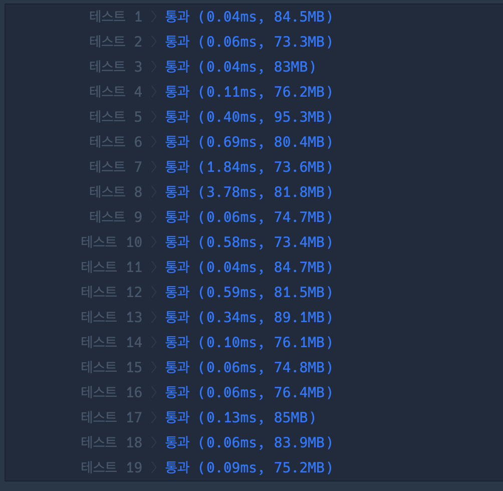

``` java
import java.io.*;
import java.util.*;

class Solution {
    
    private static int visited;
    private static int M, K, cnt;
    
    public int solution(int k, int[][] dungeons) {
        K = k;
        M = dungeons.length;
        dfs(0, dungeons, true);
        return cnt;
    }
    
    private static void dfs(int depth, int[][] dungeons, boolean isExplore) {
        
        if(!isExplore || depth == M) {
            cnt = Math.max(cnt, depth);
        }else {
            for(int i = 0; i < M; i++) {
                
                if((visited & (1<< i)) == 0) {
                    if(dungeons[i][0] <= K) {
                        K -= dungeons[i][1];
                        visited |= (1<<i);
                        dfs(depth+1, dungeons, true);
                        visited ^= (1<<i);
                        K += dungeons[i][1];
                    }else {
                        dfs(depth, dungeons, false);
                    }
                }
            }
        }
        
    }
    
}
```


